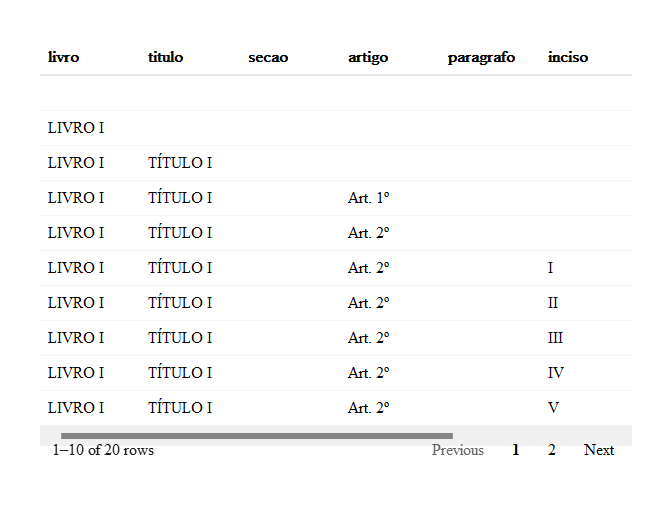

PDF de projeto de lei para data.frame
================
2023-05-13

## Sobre o texto do pdf

PDF de um projeto de lei.

Hierarquia:

> livro \> título \> Capítulo \> seção \> artigo \> parágrafo \> inciso
> \> alínea

#### Exemplo de texto:

``` r
library(tidyverse, warn.conflicts = FALSE)
f <- glue::glue
`%|NA|%` <- function(lhr, rhs) ifelse(is.na(lhr), rhs, lhr)
paginas <- pdftools::pdf_text("DOC-Avulso inicial da matéria - SF212063437642-20210916.pdf")
cat(paginas[[5]])
```

    ##                                                    LIVRO II
    ##                      DOS DIREITOS E DEVERES FUNDAMENTAIS DOS ELEITORES
    ## 
    ## 
    ##                                                  TÍTULO ÚNICO
    ##                           DO VOTO E DA LIBERDADE DE EXERCÍCIO DO VOTO
    ## 
    ## 
    ##                            Art. 8º O voto constitui um direito e uma obrigação, exercido com o fim
    ##           de integrar as instâncias representativas do Estado democrático brasileiro, bem como
    ##           efetivar outras modalidades de democracia participativa previstas na Constituição
    ##           Federal.
    ##                            Art. 9º Ninguém poderá impedir ou embaraçar a liberdade de exercício
    ##           do voto, sob pena de aplicação das sanções impostas nesta Lei.
    ##                            § 3º A liberdade a que se refere o caput deste artigo alcança, inclusive,
    ##           o período que antecede a jornada da votação.
    ##                            § 4º A autoridade que tiver ciência de ato que ameaça, limita ou
    ##           inviabiliza a liberdade de voto é obrigada a promover a sua apuração imediata, sob pena
    ##           de responsabilidade penal e administrativa.
    ##                            Art. 10. Qualquer cidadão pode postular a investidura em cargo eletivo,
    ##           respeitadas as condições fixadas na Constituição Federal e nesta Lei.
    ##                            Art. 11. Consideram-se eleitores os brasileiros maiores de 16
    ##           (dezesseis) anos que se alistarem na forma estabelecida nesta Lei.
    ##                            Art. 12. O alistamento eleitoral e o voto são obrigatórios para os
    ##           maiores de 18 (dezoito) anos e facultativos para:
    ##                            I - os analfabetos;
    ##                            II - os maiores de 70 (setenta) anos;
    ##                            III - os maiores de 16 (dezesseis) e menores de 18 (dezoito) anos.
    ##                           § 1º O alistamento e o voto são obrigatórios para todas as pessoas com
    ##         deficiência, afastando-se a sanção quando se tornar impossível ou demasiadamente
    ##         oneroso o cumprimento de tais obrigações.
    ## 
    ## 
    ## 
    ##                                                               *$238650$220531$*
    ##                                                               *$238650$220531$*
    ##                                                                                   Documento : 90944 - 14
    ## 
    ## 
    ## Página 5 de 393                           Avulso do PLP 112/2021.

## Tratamento inicial

Primeiro juntar todas as páginas em uma única string para as quebras de
página não atrapalhar.

``` r
# limpa coisas inúteis, principalmente do rodapé
limpeza_basica <- function(texto) {
  texto %>%
    # remove coisa do tipo "Documento : 90944 - 11"
    str_remove_all("Documento : [0-9]{1,6} - [0-9]{1,6}") %>%
    # remove coisa do tipo "*$238650$220531$*"
    str_remove_all("\\*\\$[0-9$]+\\$\\*") %>%
    # remove coisa do tipo "Página 4 de 393"
    str_remove_all("Página [0-9]{1,3} de 393") %>%
    # remove coisa do tipo ""Avulso do PLP 112/2021."
    str_remove_all("Avulso do PLP 112/2021\\.")
}

documento <- paginas %>%
  str_c(collapse = "") %>%
  limpeza_basica()
```

## Livros

``` r
livros <- documento %>% 
  str_split_1("(?=LIVRO )") %>%
  enframe(name = "livro", value = "conteudo") %>%
  mutate(
    livro = str_extract(conteudo, "LIVRO [IVXDLCM]+") %|NA|% "_VAZIO_",
    conteudo = str_remove(conteudo, fixed(livro))
  ) 
livros %>% count(livro)
```

    ## # A tibble: 24 × 2
    ##    livro          n
    ##    <chr>      <int>
    ##  1 LIVRO I        1
    ##  2 LIVRO II       1
    ##  3 LIVRO III      1
    ##  4 LIVRO IV       1
    ##  5 LIVRO IX       1
    ##  6 LIVRO V        1
    ##  7 LIVRO VI       1
    ##  8 LIVRO VII      1
    ##  9 LIVRO VIII     1
    ## 10 LIVRO X        1
    ## # … with 14 more rows

## Títulos

``` r
titulos <- livros %>%
  mutate( 
    conteudo = map(conteudo, function(conteudo) {
      conteudo %>% 
        str_split_1("(?=TÍTULO )") %>%
        enframe(name = "titulo", value = "conteudo") %>%
        mutate(
          titulo = str_extract(conteudo, "TÍTULO ([IVXDLCM]+|ÚNICO)") %|NA|% "_VAZIO_",
          conteudo = str_remove(conteudo, fixed(titulo))
        ) 
    })
  ) %>% 
  unnest(conteudo)
titulos %>% count(titulo)
```

    ## # A tibble: 21 × 2
    ##    titulo          n
    ##    <chr>       <int>
    ##  1 TÍTULO I       18
    ##  2 TÍTULO II      18
    ##  3 TÍTULO III     16
    ##  4 TÍTULO IV      13
    ##  5 TÍTULO IX       1
    ##  6 TÍTULO V        5
    ##  7 TÍTULO VI       4
    ##  8 TÍTULO VII      2
    ##  9 TÍTULO VIII     2
    ## 10 TÍTULO X        1
    ## # … with 11 more rows

## Capítulos

``` r
capitulos <- titulos %>%
  mutate( 
    conteudo = map(conteudo, function(conteudo) {
      conteudo %>% 
        str_split_1("(?=CAPÍTULO )") %>%
        enframe(name = "capitulo", value = "conteudo") %>%
        mutate(
          capitulo = str_extract(conteudo, "CAPÍTULO ([IVXDLCM]+|ÚNICO)") %|NA|% "_VAZIO_",
          conteudo = str_remove(conteudo, fixed(capitulo))
        ) 
    })
  ) %>% 
  unnest(conteudo)
capitulos %>% count(capitulo)
```

    ## # A tibble: 10 × 2
    ##    capitulo           n
    ##    <chr>          <int>
    ##  1 CAPÍTULO I        19
    ##  2 CAPÍTULO II       19
    ##  3 CAPÍTULO III      15
    ##  4 CAPÍTULO IV        9
    ##  5 CAPÍTULO V         8
    ##  6 CAPÍTULO VI        4
    ##  7 CAPÍTULO VII       2
    ##  8 CAPÍTULO VIII      1
    ##  9 CAPÍTULO ÚNICO     1
    ## 10 _VAZIO_          115

## Seções

``` r
secoes <- titulos %>%
  mutate( 
    conteudo = map(conteudo, function(conteudo) {
      conteudo %>% 
        str_split_1("(?=Seção )") %>%
        enframe(name = "secao", value = "conteudo") %>%
        mutate(
          secao = str_extract(conteudo, "Seção ([IVXDLCM]+|Única)") %|NA|% "_VAZIO_",
          conteudo = str_remove(conteudo, fixed(secao))
        ) 
    })
  ) %>% 
  unnest(conteudo)
secoes %>% count(secao)
```

    ## # A tibble: 12 × 2
    ##    secao           n
    ##    <chr>       <int>
    ##  1 Seção I         8
    ##  2 Seção II        8
    ##  3 Seção III       8
    ##  4 Seção IV        5
    ##  5 Seção IX        1
    ##  6 Seção V         3
    ##  7 Seção VI        3
    ##  8 Seção VII       1
    ##  9 Seção VIII      1
    ## 10 Seção X         1
    ## 11 Seção Única     1
    ## 12 _VAZIO_       115

## Artigos

``` r
artigos <- secoes %>%
  mutate( 
    conteudo = map(conteudo, function(conteudo) {
      conteudo %>% 
        str_split_1("(?=Art\\. )") %>%
        enframe(name = "artigo", value = "conteudo") %>%
        mutate(
          artigo = str_extract(conteudo, "Art\\. +[0-9]+ *[º°.]") %|NA|% "_VAZIO_",
          conteudo = str_remove(conteudo, fixed(artigo))
        )
    })
  ) %>% 
  unnest(conteudo)
artigos %>% count(artigo)
```

    ## # A tibble: 899 × 2
    ##    artigo        n
    ##    <chr>     <int>
    ##  1 Art. 10.      1
    ##  2 Art. 100.     1
    ##  3 Art. 101.     1
    ##  4 Art. 102.     1
    ##  5 Art. 103.     1
    ##  6 Art. 104.     1
    ##  7 Art. 105.     1
    ##  8 Art. 106.     1
    ##  9 Art. 107.     1
    ## 10 Art. 108.     1
    ## # … with 889 more rows

## Parágrafos

``` r
paragrafos <- artigos %>%
  mutate( 
    conteudo = map(conteudo, function(conteudo) {
      conteudo %>% 
        str_split_1("(?=   (§|Parágrafo) )") %>%
        enframe(name = "paragrafo", value = "conteudo") %>%
        mutate(
          paragrafo = str_extract(conteudo, "   (§ +[0-9]+ *[º°.]|Parágrafo único\\.)") %|NA|% "_VAZIO_",
          conteudo = str_remove(conteudo, fixed(paragrafo)),
          paragrafo = str_replace(paragrafo, " *[°º]", "º") %>% str_squish(),
        )
    })
  ) %>% 
  unnest(conteudo)
paragrafos %>% count(paragrafo)
```

    ## # A tibble: 17 × 2
    ##    paragrafo            n
    ##    <chr>            <int>
    ##  1 Parágrafo único.   198
    ##  2 _VAZIO_           1054
    ##  3 § 10.                9
    ##  4 § 11.                7
    ##  5 § 12.                5
    ##  6 § 13.                5
    ##  7 § 14.                3
    ##  8 § 15.                2
    ##  9 § 1º               302
    ## 10 § 2º               304
    ## 11 § 3º               200
    ## 12 § 4º               134
    ## 13 § 5º                85
    ## 14 § 6º                51
    ## 15 § 7º                29
    ## 16 § 8º                23
    ## 17 § 9º                12

## Incisos

``` r
incisos <- paragrafos %>%
  mutate( 
    conteudo = map(conteudo, function(conteudo) {
      conteudo %>% 
        str_split_1("(?= {5}[IVXDLCM]+ )") %>%
        enframe(name = "inciso", value = "conteudo") %>%
        mutate(
          inciso = str_extract(conteudo, "^ {5}[IVXDLCM]+[– -]+ ") %|NA|% "_VAZIO_",
          conteudo = str_remove(conteudo, fixed(inciso)),
          inciso = str_remove_all(inciso, "[– -]")
        )
    })
  ) %>% 
  unnest(conteudo)
incisos %>% count(inciso)
```

    ## # A tibble: 24 × 2
    ##    inciso     n
    ##    <chr>  <int>
    ##  1 I        291
    ##  2 II       291
    ##  3 III      197
    ##  4 IV       112
    ##  5 IX        24
    ##  6 V         79
    ##  7 VI        56
    ##  8 VII       43
    ##  9 VIII      30
    ## 10 X         19
    ## # … with 14 more rows

## Alíneas

``` r
alineas <- incisos %>%
  mutate( 
    conteudo = map(conteudo, function(conteudo) {
      conteudo %>% 
        str_split_1("(?= {5}[a-z]{1,2}\\) )") %>%
        enframe(name = "alinea", value = "conteudo") %>%
        mutate(
          alinea = str_extract(conteudo, "^ {5}[a-z]{1,2}\\) ") %|NA|% "_VAZIO_",
          conteudo = str_remove(conteudo, fixed(alinea)),
          alinea = str_remove_all(alinea, "[ )]"),
        )
    })
  ) %>% 
  unnest(conteudo)
alineas %>% count(alinea)
```

    ## # A tibble: 14 × 2
    ##    alinea      n
    ##    <chr>   <int>
    ##  1 _VAZIO_  3626
    ##  2 a          47
    ##  3 b          47
    ##  4 c          28
    ##  5 d          18
    ##  6 e          13
    ##  7 f          11
    ##  8 g           6
    ##  9 h           4
    ## 10 i           3
    ## 11 j           3
    ## 12 k           3
    ## 13 l           3
    ## 14 m           2

## Tabela final

``` r
tabela_final <- alineas %>%
  mutate(
    across(everything(), str_squish),
    across(everything(), ~ str_replace(.x, "_VAZIO_", ""))
  )
reactable::reactable(head(tabela_final, 20), wrap = FALSE)
```

<!-- -->

``` r
# writexl::write_xlsx(tabela_final, "DOC-Avulso inicial da matéria - SF212063437642-20210916.xlsx")
```
